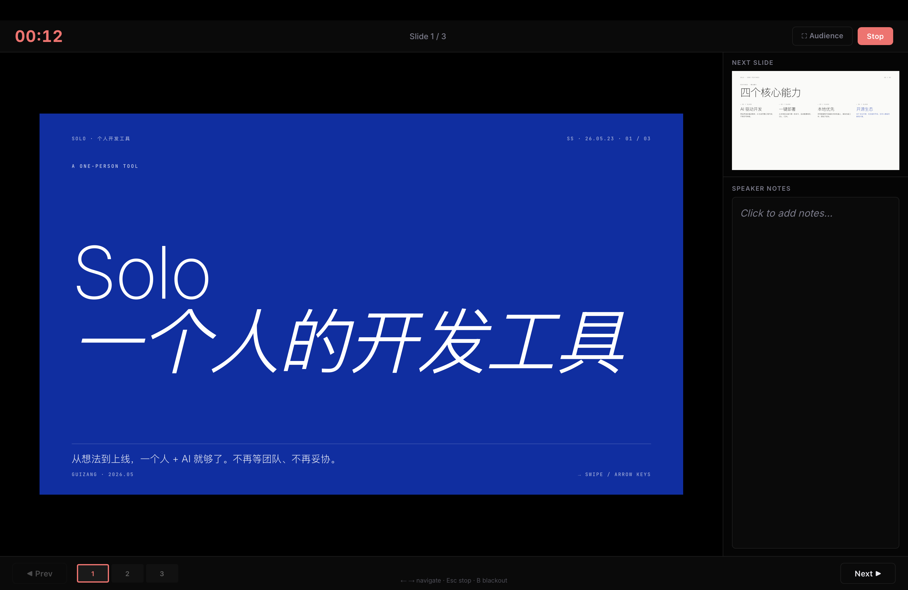

# HTML Presenter View / HTML 演讲者视图

[](#)
[](#)
[](#)
[](#许可证)

[English](README.md)

为任意 HTML 幻灯片添加专业演讲者视图。

`HTML Presenter View` 是一个零依赖、框架无关的浏览器演讲者控制台。它会打开一个独立的演讲者窗口，提供当前页预览、下一页预览、演讲备注、计时器、缩略图导航、黑屏模式和观众全屏控制。

## 为什么需要它

很多 HTML PPT 在视觉表达上很自由，但缺少 Keynote 或 PowerPoint 里常见的演讲者工具。

这个项目保持幻灯片仍然是普通 HTML，同时补齐演讲时需要的工作流：

- 查看当前页和下一页。
- 在演讲过程中查看并临时编辑备注。
- 在独立窗口中控制观众视图。
- 支持从 `file://`、`localhost` 或线上页面直接演示。

## 功能特性

- 当前页预览按观众窗口尺寸渲染，再等比缩放，避免右侧或底部内容被裁切。
- 下一页预览，方便提前准备转场。
- 支持从 `data-notes` 属性或隐藏的 `.speaker-notes` 元素读取演讲备注。
- 演讲者窗口内可临时编辑备注，当前会话内生效。
- 打开演讲者视图后自动开始计时。
- 显示页码，并支持缩略图快速跳转。
- 支持方向键和空格键翻页。
- 按 `B` 可让观众视图临时黑屏。
- `Audience` 按钮可控制观众窗口全屏，适合单屏和双屏演示。
- 无需构建步骤，无运行时依赖，不绑定任何框架。

## 示例

打开内置示例：

```bash
open test-ppt/index.html
```

然后按 `P` 打开演讲者视图。

如果浏览器拦截弹窗，请允许该页面弹窗后再次按 `P`。

### 观众视图


### 演讲者视图



## 快速开始

将运行时文件复制到你的 HTML 幻灯片同级目录：

```bash
cp assets/presenter-view.js path/to/your/deck/
cp assets/presenter-view.css path/to/your/deck/
```

在 `</body>` 前加入：

```html
<!-- Presenter View -->
<link rel="stylesheet" href="presenter-view.css">
<script src="presenter-view.js"></script>
<script>
  PresenterView.init({ slideSelector: '.slide' });
</script>
```

确保每一页幻灯片都匹配这个选择器：

```html
<section class="slide">
  <h1>Hello</h1>
</section>
```

在浏览器中打开 HTML 文件，然后按 `P`。

## 演讲备注

使用 `data-notes` 属性：

```html
<section class="slide" data-notes="这里写演讲备注。">
  <h1>发布计划</h1>
</section>
```

或添加隐藏的备注元素：

```html
<section class="slide">
  <h1>发布计划</h1>
  <div class="speaker-notes" hidden>
    这里写演讲备注。
  </div>
</section>
```

## 快捷键

| 按键 | 操作 |
| --- | --- |
| `P` | 打开或关闭演讲者视图 |
| `Right`, `Down`, `Space` | 下一页 |
| `Left`, `Up` | 上一页 |
| `B` | 切换观众视图黑屏 |
| `Esc` | 关闭演讲者视图 |

## API

```js
PresenterView.init({ slideSelector: '.slide' });

PresenterView.start();
PresenterView.stop();
PresenterView.next();
PresenterView.prev();
PresenterView.goTo(3); // 从 0 开始计数

console.log(PresenterView.isActive);
console.log(PresenterView.slideCount);
console.log(PresenterView.currentIndex);
```

## 配置

```js
PresenterView.init({
  slideSelector: '.slide',
  notesAttribute: 'data-notes',
  notesSelector: '.speaker-notes',
  startKey: 'p',
  aspectRatio: 16 / 9,
  dispatchNavKeys: true,
  onNavigate: null,
});
```

| 选项 | 默认值 | 说明 |
| --- | --- | --- |
| `slideSelector` | `.slide` | 用于收集幻灯片的 CSS 选择器 |
| `notesAttribute` | `data-notes` | 备注属性名 |
| `notesSelector` | `.speaker-notes` | 备注元素选择器 |
| `startKey` | `p` | 启动演讲者视图的快捷键 |
| `aspectRatio` | `16 / 9` | 无法读取 viewport 时的备用比例 |
| `dispatchNavKeys` | `true` | 通过派发方向键事件驱动现有幻灯片导航 |
| `onNavigate` | `null` | 自定义导航回调：`(index, direction) => void` |

## Codex Skill 用法

这个仓库也可以作为 Codex skill 使用。

安装到本地 Codex skills 目录：

```bash
rsync -a --exclude .git ./ ~/.codex/skills/html-presenter-view/
```

重启 Codex 后，直接告诉 Codex：

```text
为 ./my-deck/index.html 添加演讲者视图
```

Codex 会复制资源文件、注入初始化代码，并在能推断时自动使用正确的幻灯片选择器。

## 实现原理

演讲者窗口完全由原生浏览器 API 生成：

- `window.open` 创建演讲者控制台窗口。
- `window.postMessage` 同步观众页面和演讲者页面状态。
- 预览 iframe 按观众窗口 viewport 渲染幻灯片，再整体缩放适配控制台。
- 预览 iframe 会继承源页面的 `html` 和 `body` class/style。
- 预览专用 CSS 会静态显示常见动画占位元素，例如 `[data-anim]`。

这样可以保证 `vw`、`vh`、绝对定位和响应式布局与观众实际看到的画面一致。

## 项目结构

```text
.
├── assets/
│   ├── presenter-view.css
│   └── presenter-view.js
├── test-ppt/
│   ├── index.html
│   ├── presenter-view.css
│   └── presenter-view.js
├── README.md
├── README.zh-CN.md
└── SKILL.md
```

## 浏览器说明

- 演讲者视图会打开弹窗，因此需要允许幻灯片页面弹窗。
- 全屏请求受浏览器权限限制，通常必须由用户操作触发。
- 支持 `file://`，因为同步基于 `postMessage`，不依赖同源通道。

## 许可证

MIT。详见 `assets/presenter-view.js` 文件头部声明。
